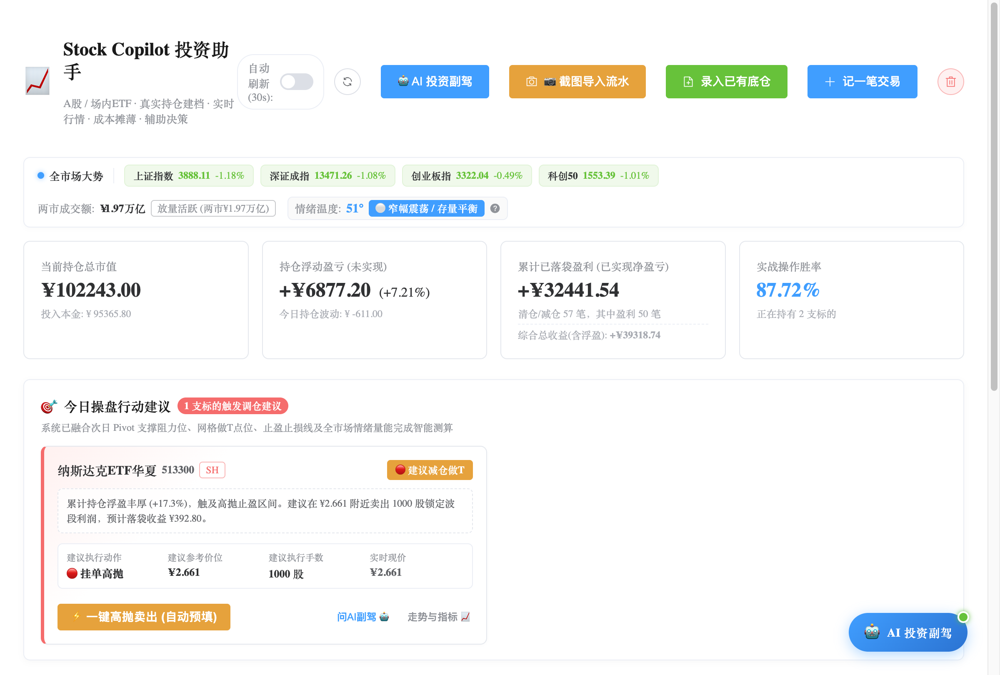
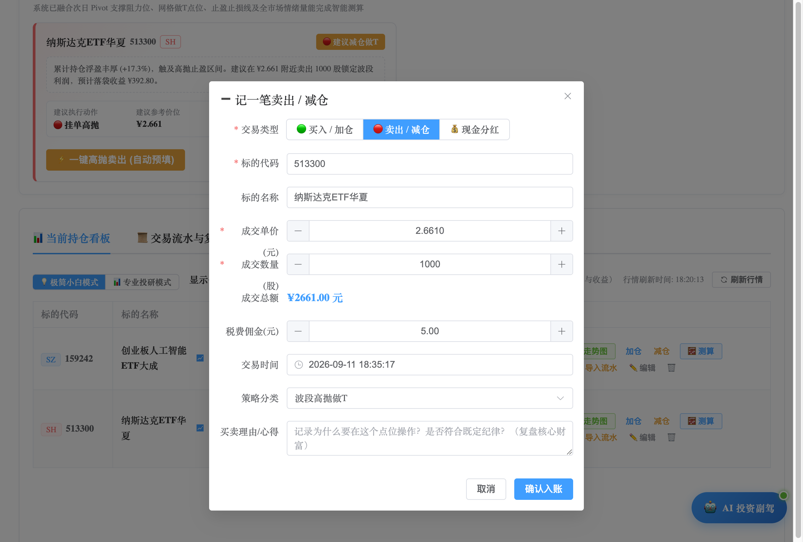
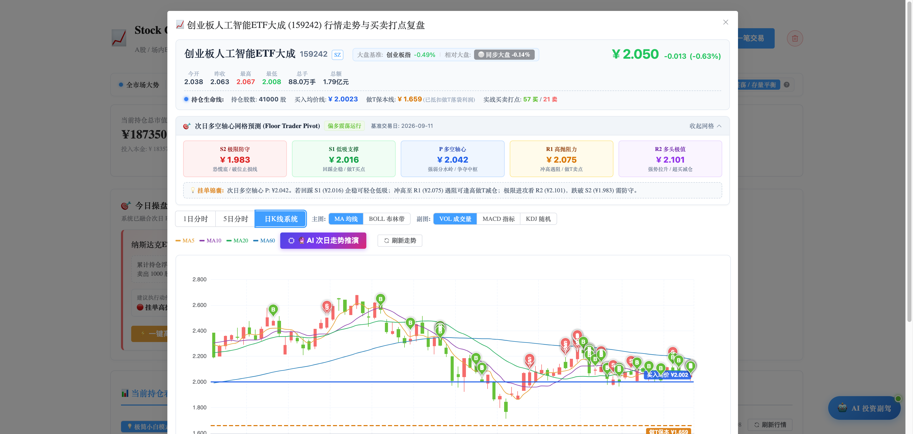
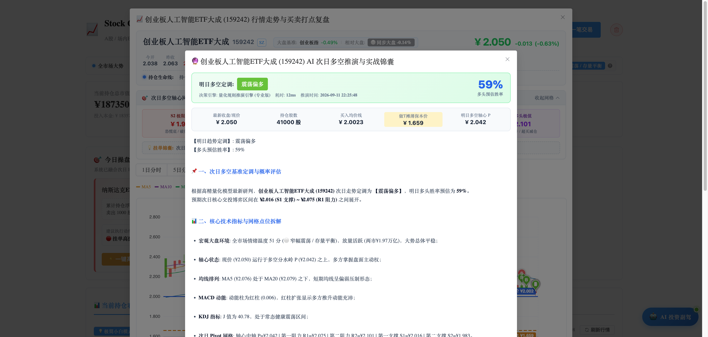

# 📈 Stock Copilot (智能投资助手与操盘复盘系统)

> **专为个人自用打造的 A 股 / 场内 ETF 智能交易决策、成本加权摊薄、次日走势量化推演与全流程操盘复盘系统。**  
> 既为资深投资者保留深度量化指标与券商级对账能力，又为普通求稳散户提供**“开箱即用、看懂指令、无脑执行、单纯赚钱”**的极简操作闭环。

---

## 📸 系统实盘界面截图

### 1. 🎯 今日操盘行动看板 (一眼看懂买卖指令，无需定目标)
系统结合次日 Pivot 支撑阻力位、网格做T点位与全市场宏观情绪完成智能测算，醒目呈现今日待办建议，并配备 **【⚡ 一键低吸/高抛卖出】** 预填弹窗；若标的处于安全持股区间，则呈现温馨舒缓的「☕ 安心持股待机」卡片。



---

### 2. 💡 极简小白模式 vs 📊 专业投研模式 (自由一键切换)
- **极简小白模式 (默认)**：自动隐藏复杂的量化摊薄参数与 Alpha 指标，持仓看板精简为 **6 个核心列**（代码、名称、现价、我的持仓与盈亏、今日决策指令、操作），直观透明，告别参数恐慌；
- **专业投研模式**：一键恢复全部 12 列金融参数（买入均价、摊薄保本价、持仓量、市值、浮盈率、券商累计总盈亏、相对大盘强弱度 Alpha 标签、分红登记等）。


---

### 3. ⚡ 一键预填交易 (零思考完成规范记账)
点击看板上的建议按钮，系统自动带入买卖方向、当前算法测算的最优价格、建议手数与策略理由，核对后点击“确认入账”即可闭环完成建档。



---

### 4. 📈 行情走势系统与次日多空轴心网格 (Pivot Points)
支持 1 日分时、5 日分时及日 K 线系统，图表上精准打点复盘所有历史买入（B）与卖出（S）记录，标出持仓成本线与做 T 保本线；提供经典场内交易员轴心点系统（$P, R_1, R_2, S_1, S_2$）与 MA/BOLL/VOL/MACD/KDJ 全套量化指标。



---

### 5. 🔮 AI 次日走势推演与实战做T锦囊 (双引擎驱动)
融合全市场大盘情绪、相对强弱度、Pivot 支撑阻力网格与**您的真实持仓保本线**，生成包含【明日趋势定调】、【多头预估胜率】与【个性化做T点位】的详实投研报告。



---

## 🌟 核心功能特性

### 1. 🎯 智能操盘决策与行动看板
* **做T高抛减仓触发**：当较前次买点反弹 $\ge +4.0\%$，或持仓浮盈 $\ge +6.0\%$ 且日内冲高回落时，亮红灯提示减仓锁定波段利润；
* **逢低网格加仓触发**：较前次买点回调 $\le -3.0\%$，或持仓微亏 $\le -3.5\%$，或日内急跌时，亮绿灯提示在支撑位挂单加仓摊薄均价；
* **大盘逆风降级保护**：大盘破位急跌（$\le -1.5\%$）或市场恐慌时，启动防踩踏过滤器，自动将建议买入手数减半，防止左侧重仓被套；
* **自适应仓位手数管理**：根据持仓规模自动匹配最合理的做T股数（占底仓约 3%~10%），实现“底仓不动，只动活动筹码”。

### 2. 🧮 券商级成本摊薄与双口径对账
* **真实买入均价**：准确记录当前筹码的实际加权买入成本；
* **摊薄保本单价（与券商 App 一致）**：自动抵扣历史所有做T已落袋利润与现金分红，清晰标出持仓的“保本安全垫”；
* **交易流水撤销重放**：任意撤销或修改历史流水，系统自动按时间正序重新回放推演全部交易，确保账目分毫不差。

### 3. 🌐 全市场宏观大盘晴雨表
* 实时监控四大指数：上证指数、深证成指、创业板指、科创50；
* 汇总两市总成交额并评判放量/缩量状态；
* 市场多空情绪综合温度计（0~100°：过热 / 偏多 / 窄幅平衡 / 偏空 / 恐慌）；
* 计算个股相对基准大盘的相对强弱度（Alpha 超额收益）。

### 4. 🔮 AI 次日走势推演与副驾问答
* **双引擎架构**：
  * **主引擎（大模型深度推演）**：接入 OpenAI / DeepSeek / Claude / Qwen / 本地 Ollama，输入全量结构化因子，产出深度推演；
  * **备用引擎（本地量化规则引擎）**：无网络或无 API Key 时自动触发，基于 50% 基础分的多因子算法（均线、轴心中轴、MACD红绿柱、KDJ超买超卖）秒级出具分析报告。
* **随叫随到的 AI 投资副驾**：右下角常驻悬浮抽屉，自动携带账户全局持仓上下文，随时解答投资困惑。

### 5. 📷 截图导入流水 (多模态视觉识别)
* 支持直接拖拽或粘贴各券商 App 交易交割单、流水对账截图；
* 自动识别代码、名称、买卖方向、价格、数量、费用及成交时间；
* 内置大模型 JSON 截断自动救回与容错修复机制，解析成功率高达 100%。

### 6. 🧮 加仓成本摊薄与回本推演器 (Cost Simulator)
* 输入“拟在 X 元补仓/卖出 Y 股”，实时测算持仓均价变化与所需反弹幅度；
* 点击“应用至实际交易”，直接将推演结果无缝带入录单。

---

## 🛠 技术架构

| 层级 | 技术选型 | 说明 |
| :--- | :--- | :--- |
| **后端框架** | Java 17 + Spring Boot 3.3.4 | 现代化企业级微服务核心 |
| **持久层** | MyBatis-Plus 3.5.7 + SQLite 3 | 数据直接落盘于 `data/stock.db`，轻量免运维 |
| **前端体系** | Vue 3 + Vite + Element Plus + Axios | 响应式现代化 SPA，开箱即用 |
| **金融行情源** | 新浪财经 / 腾讯证券 HTTP API | 实时轮询 A 股、ETF、大盘指数分时与日K历史数据 |
| **量化指标计算** | 纯 Java 原生量化算法库 | 独立计算 MA、BOLL(20,2)、MACD(12,26,9)、KDJ(9,3,3)、Floor Trader Pivot |
| **AI 模型接入** | 标准 OpenAI 兼容协议 + 本地规则兜底 | 完美支持 DeepSeek-V3/R1、Qwen、OpenAI 及本地 Ollama |

---

## 🚀 本地快速启动

### 准备环境
* **JDK 17+**
* **Node.js 18+** 与 npm
* **Maven 3.8+**

### 1. 启动后端服务 (Spring Boot)
打开终端窗口执行：
```bash
cd backend
mvn spring-boot:run
```
后端服务将在 `http://localhost:8080` 启动，自动检测并连接本地 SQLite 数据库文件 `data/stock.db`。

### 2. 启动前端服务 (Vue 3 + Vite)
打开第二个终端窗口执行：
```bash
cd frontend
npm install   # 首次运行安装依赖
npm run dev
```
控制台输出本地地址后，在浏览器访问：
👉 **`http://localhost:5173`**

*(所有前端 `/api` 请求已通过 Vite 开发服务器反向代理自动转发至后端 8080 端口，无需任何跨域配置)*。

---

## 🧪 自动化测试验证

系统配备了全套自动化单元测试，涵盖买入加仓摊薄、卖出落袋净收益、分红降本、胜率统计、大模型视觉 OCR 容错救回等核心链路：

```bash
cd backend
mvn test
```

> **测试覆盖**：19 项单元测试全部通过 (`BUILD SUCCESS`)。

---

## 📂 目录结构规范

```text
stock-copilot/
├── backend/                  # Spring Boot 后端项目
│   ├── src/main/java/com/stock/
│   │   ├── controller/       # REST API 控制器 (持仓、流水、行情、副驾、测算)
│   │   ├── service/          # 核心业务逻辑 (TradeService, TradeSignalService, CopilotService 等)
│   │   ├── dto/ & vo/        # 数据传输与展示视图对象
│   │   └── entity/           # SQLite 实体映射
│   └── src/test/             # 单元测试与用例
├── frontend/                 # Vue 3 前端工程
│   ├── src/
│   │   ├── App.vue           # 首页主看板 (今日行动看板、小白/专业切换、持仓表格)
│   │   ├── components/       # 业务弹窗组件群 (走势图K线、AI副驾抽屉、做T测算器、记账弹窗等)
│   │   └── api/              # 后端 Axios 接口封装
├── data/
│   └── stock.db              # SQLite 本地数据库文件 (真实历史流水与持仓持久化)
├── doc/
│   ├── db/                   # 数据库初始化表结构 SQL
│   └── screenshots/          # 系统高清功能截图
└── README.md                 # 项目使用与架构文档
```

---

## ⚠️ 免责声明
本系统仅供个人量化学习与个人资产记录辅助使用，系统输出的所有交易建议、Pivot 点位及 AI 推演结论均基于历史统计模型与公开行情数据，**不构成任何投资咨询或买卖依据**。股市有风险，入市需谨慎，请严格遵守个人交易纪律！
